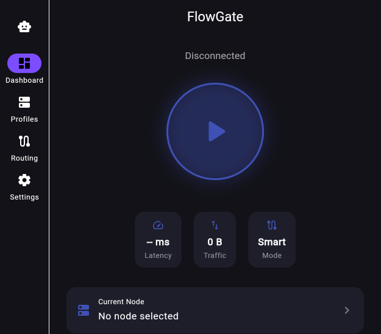
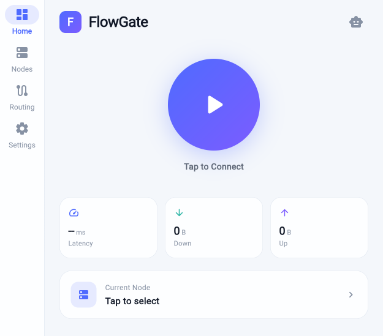

# FlowGate

跨平台智能 VPN 客户端，基于 Flutter + sing-box。

## 特性

- **跨平台**: Android / Windows
- **多协议**: VMess / VLESS / Trojan / Shadowsocks / SOCKS
- **VPN 模式**: Android 原生 VPN 权限，系统级流量路由
- **订阅管理**: 添加/刷新/删除订阅，自动分组，节点搜索
- **测速**: 一键全节点测速 + 分组级测速，延迟可视化
- **智能路由**: 按服务自适应选择直连/代理
- **国际化**: 中文 / English

## 项目状态

**v0.3 — 功能可用阶段**

已完成：
- [x] sing-box 核心集成（FFI）
- [x] Android VPN 权限 + 系统级代理
- [x] 订阅管理（添加/刷新/分组/搜索）
- [x] 节点测速（单节点/分组/全量）
- [x] 连接状态实时反馈
- [x] Material Design 3 UI
- [x] 中英文国际化

规划中：
- [ ] AI 助手（网络诊断 + 路由推荐）
- [ ] Windows 平台适配

## 截图

| 仪表盘 | 节点列表 | 连接状态 |
|--------|--------|--------|
|  |  |  |

## 目录结构

```
flowgate/
├── archive/          # 旧版代码归档 (仅供参考)
├── app/              # Flutter 主工程
└── README.md
```

## 技术栈

| 层 | 技术 |
|----|------|
| UI | Flutter 3.x + Material Design 3 |
| 状态管理 | Riverpod |
| 路由 | go_router |
| 本地存储 | Hive |
| 代理核心 | sing-box (libbox FFI) |
| 国际化 | flutter_localizations + ARB |

## 开发工作流

- 分支: `main` -> `develop` -> `feat/x.y-description`
- 每个 Story 一个 feat 分支 + PR
- 每个 Epic 完成后打 tag

## License

[MIT](LICENSE)
