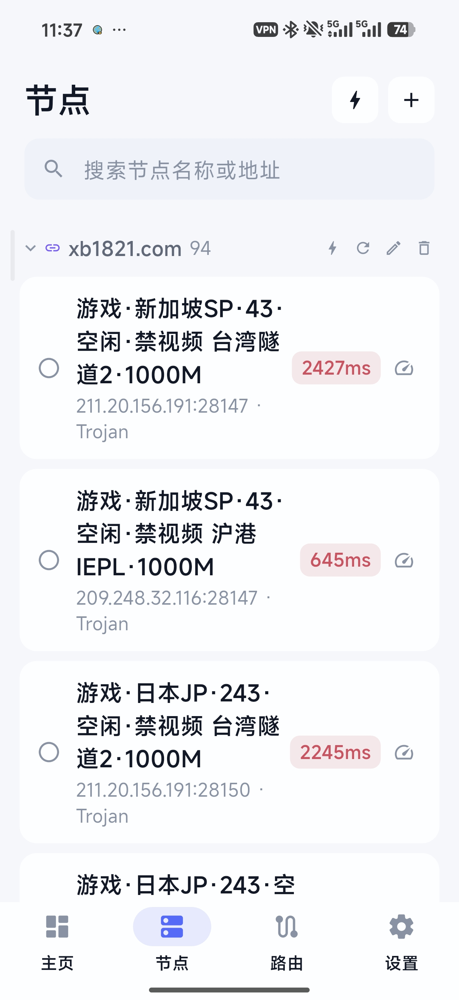
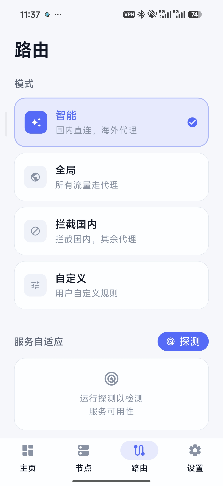
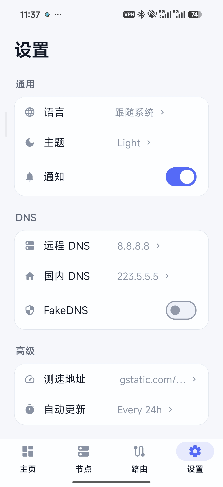

# FlowGate

跨平台智能 VPN 客户端，基于 Flutter + Xray-core。

## 特性

- **多协议**: VMess / VLESS / Trojan / Shadowsocks / SOCKS
- **VPN 模式**: Android 原生 VpnService，Xray JNI 进程内运行，不受系统 LMK 影响
- **订阅管理**: URL 导入（支持标准/URL-safe base64）、刷新、删除、自动分组
- **节点测速**: 并行测速（5 并发池）+ 分组级测速，延迟可视化
- **智能路由**: 按规则分流直连/代理/拦截
- **Material Design 3**: 暗色主题，流畅动画
- **国际化**: 中文 / English

## 截图

| 节点列表 | 路由规则 | 设置 |
|--------|--------|--------|
|  |  |  |

## 目录结构

```
flowgate/
├── archive/          # 旧版代码归档 (v2rayNG fork, 仅供参考)
├── app/              # Flutter 主工程
│   ├── lib/
│   │   ├── core/     # 引擎、状态、服务、主题
│   │   └── features/ # 仪表盘、节点、路由、设置
└── README.md
```

## 技术栈

| 层 | 技术 |
|----|------|
| UI | Flutter 3.x + Material Design 3 |
| 状态管理 | Riverpod |
| 路由 | go_router |
| 本地存储 | Hive + SharedPreferences |
| 代理核心 | Xray-core (flutter_v2ray, JNI in-process) |
| 国际化 | flutter_localizations + ARB |
| 流量图表 | fl_chart |

## 架构亮点

- **Xray JNI in-process**: 通过 `libv2ray.aar` 的 gomobile 绑定，Xray 核心在 VpnService 进程内运行（`V2RayPoint.runLoop()`），受前台服务保护，不会被 Android LMK 回收
- **并发池测速**: 5 个 worker 并行测速，结果实时回写 UI
- **配置组装器**: 自动注入路由规则、policy 超时、sniffing、流量统计

## 开发工作流

- 分支: `master` -> `feat/x.y-description`
- 每个 Story 一个 feat 分支 + PR
- 每个 Epic 完成后打 tag

## License

[MIT](LICENSE)
